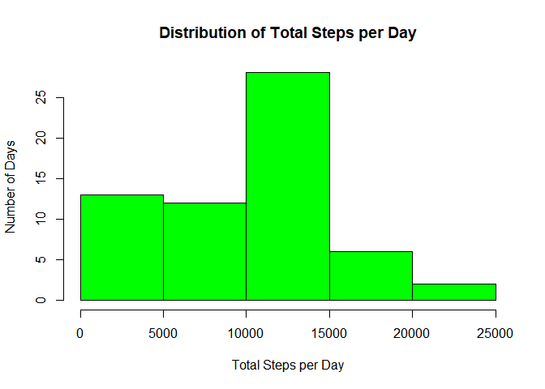
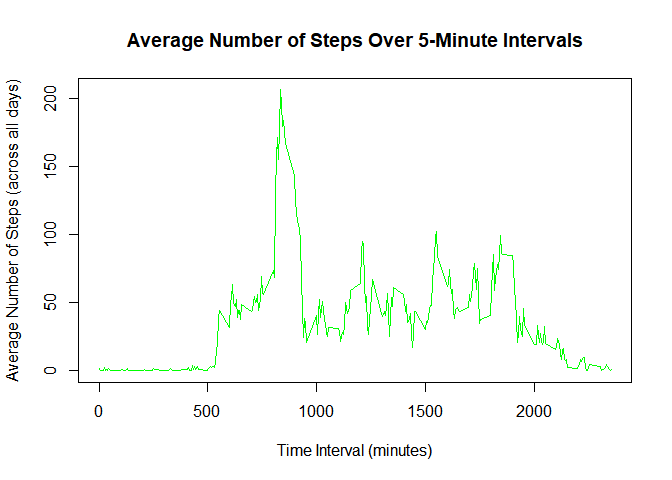
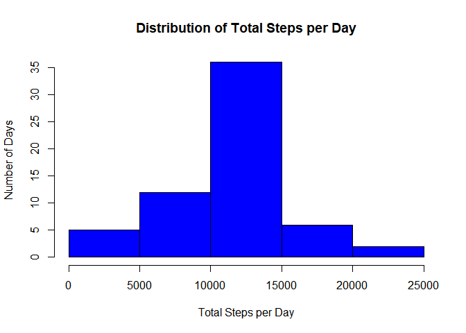
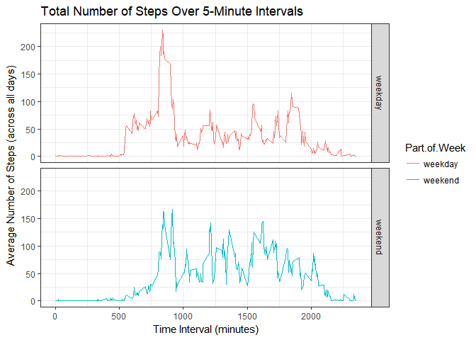

## Loading and preprocessing the data
Downloaded dataset to local computer and unzipped the file. The contents of the zip file, activity.csv, was then read into R. Finally, the script is told to ignore warning messages to clean up output.

```r
datasetURL <- "https://d396qusza40orc.cloudfront.net/repdata%2Fdata%2Factivity.zip"
download.file(datasetURL, destfile = "C:\\Users\\Isaac\\Documents\\Coursera Files\\Activity_monitoring_data.zip")
unzip("C:\\Users\\Isaac\\Documents\\Coursera Files\\Activity_monitoring_data.zip", 
      exdir = "C:\\Users\\Isaac\\Documents\\Coursera Files")
activityData<- read.csv("C:\\Users\\Isaac\\Documents\\Coursera Files\\activity.csv")
options(warn=-1)
```

## What is mean total number of steps taken per day?
### Make a histogram of the total number of steps taken each day
Grouped the dataset on the date field and summarized the total number of steps taken by the date. These results are then displayed in a histogram.

```r
library(dplyr)
```

```
## 
## Attaching package: 'dplyr'
```

```
## The following objects are masked from 'package:stats':
## 
##     filter, lag
```

```
## The following objects are masked from 'package:base':
## 
##     intersect, setdiff, setequal, union
```

```r
activityByDate <- group_by(activityData, date)
stepsByDate <- summarize(activityByDate, Total.Steps = sum(steps, na.rm = TRUE))
hist(stepsByDate$Total.Steps, col = "green", xlab = "Total Steps per Day", 
     ylab = "Number of Days", main = "Distribution of Total Steps per Day")
```

<!-- -->

### Calculate and report the mean and median total number of steps taken per day
Show mean and median of the dataset with the summarize. xtable also used to clean up the display

```r
library(xtable)
table1 <- xtable(summarize(stepsByDate, Mean = mean(Total.Steps, na.rm = TRUE), 
          Median = median(Total.Steps, na.rm = TRUE)))
print(table1, type = "html")
```

<!-- html table generated in R 3.4.2 by xtable 1.8-2 package -->
<!-- Mon Jun 04 20:05:25 2018 -->
<table border=1>
<tr> <th>  </th> <th> Mean </th> <th> Median </th>  </tr>
  <tr> <td align="right"> 1 </td> <td align="right"> 9354.23 </td> <td align="right"> 10395 </td> </tr>
   </table>

## What is the average daily activity pattern?
### Make a time series plot of the 5-minute interval (x-axis) and the average number of steps taken, averaged across all days (y-axis)
Grouped the dataset on the interval field and summarized the mean number of steps taken by the interval. Then plotted a time series graph to show the average number of steps over the 5-minute intervals.

```r
activityByInterval <- group_by(activityData, interval)
stepsByInterval <- summarize(activityByInterval, Average = mean(steps, na.rm = TRUE))
plot(stepsByInterval$interval, stepsByInterval$Average, type = "l", col = "green", 
     xlab = "Time Interval (minutes)", ylab = "Average Number of Steps (across all days)", 
     main = "Average Number of Steps Over 5-Minute Intervals")
```

<!-- -->

### Which 5-minute interval, on average across all the days in the dataset, contains the maximum number of steps?
Determins the maximum average number of steps taken per interval and finds which interval in the dataset has an average matching that value.

```r
table2 <- xtable(stepsByInterval[which(max(stepsByInterval$Average) == stepsByInterval$Average), "interval"])
print(table2, type = "html")
```

<!-- html table generated in R 3.4.2 by xtable 1.8-2 package -->
<!-- Mon Jun 04 20:05:26 2018 -->
<table border=1>
<tr> <th>  </th> <th> interval </th>  </tr>
  <tr> <td align="right"> 1 </td> <td align="right"> 835 </td> </tr>
   </table>

## Imputing missing values
### Calculate and report the total number of missing values in the dataset (i.e. the total number of rows with NAs)

```r
sum(is.na(activityData))
```

```
## [1] 2304
```

### Create a new dataset that is equal to the original dataset but with the missing data filled in via the mean its 5 minute interval.
Merged the steps by interval dataset with the original to connect the previously calculated average number of steps with the original data. Then replaced any missing values in the steps column with the respective value in the Average column (this would be the average for the interval the two variables share). The Average column is then removed.

```r
activityData_meanInt <- merge(activityData, stepsByInterval)
activityData_meanInt[is.na(activityData_meanInt$steps), "steps"] <- 
     activityData_meanInt[is.na(activityData_meanInt$steps), "Average"]
activityData_meanInt <- select(activityData_meanInt, -(Average))
```

### Make a histogram of the total number of steps taken each day. 
Grouped the dataset (with missing values replaced) on the date field and summarized the total number of steps on the date. Generated a histogram of the results.

```r
activityByDate_meanInt <- group_by(activityData_meanInt, date)
stepsByDate_meanInt <- summarize(activityByDate_meanInt, Total.Steps = sum(steps, na.rm = TRUE))
hist(stepsByDate_meanInt$Total.Steps, col = "blue", xlab = "Total Steps per Day", 
     ylab = "Number of Days", main = "Distribution of Total Steps per Day")
```

<!-- -->

### Calculate and report the mean and median total number of steps taken per day.

```r
table3 <- xtable(summarize(stepsByDate_meanInt, Mean = mean(Total.Steps, na.rm = TRUE), 
          Median = median(Total.Steps, na.rm = TRUE)))
print(table3, type = "html")
```

<!-- html table generated in R 3.4.2 by xtable 1.8-2 package -->
<!-- Mon Jun 04 20:05:26 2018 -->
<table border=1>
<tr> <th>  </th> <th> Mean </th> <th> Median </th>  </tr>
  <tr> <td align="right"> 1 </td> <td align="right"> 10766.19 </td> <td align="right"> 10766.19 </td> </tr>
   </table>

### Do these values differ from the estimates from the first part of the assignment? What is the impact of imputing missing data on the estimates of the total daily number of steps?
Overall, both the mean and the median were increased by replacing the missing values. This is probably because we added values that were already average for that dataset, so the new average or median were likely to increase in value by their presence. The mean and median are also not equal; I can only guess that this is due to the distribution of missing values pushing the mean to the middle of the dataset.

## Are there differences in activity patterns between weekdays and weekends?
### Create a new factor variable in the dataset with two levels -- "weekday" and "weekend" indicating whether a given date is a weekday or weekend day.
Conditionally creates a new factor variable, Part.of.Week, based on whether or not the data in the date field falls on the weekend or not.

```r
activityData_meanInt$Part.of.Week <- as.factor(ifelse(weekdays(as.Date(activityData_meanInt$date)) 
                                                      %in% c("Saturday", "Sunday"), "weekend", "weekday"))
```

### Make a panel plot containing a time series plot of the 5-minute interval (x-axis) and the average number of steps taken, averaged across all weekday days or weekend days (y-axis).
Grouped the dataset (missing values replaced) on the interval and part of the week and summarized the data on both of those variables. I then used the ggplot2 library to generate a 2 panel time series graph of intervals based on which were performed on the weekday and which were on the weekend.

```r
activityByInterval_meanInt <- group_by(activityData_meanInt, interval, Part.of.Week)
stepsByInterval_meanInt <- summarize(activityByInterval_meanInt, Average.Steps = mean(steps, na.rm = TRUE))

library(ggplot2)
g <- ggplot(stepsByInterval_meanInt, aes(interval, Average.Steps))
g + geom_line(aes(color = Part.of.Week)) + facet_grid(Part.of.Week ~ .) + theme_bw() + 
     labs(title = "Total Number of Steps Over 5-Minute Intervals", x = "Time Interval (minutes)", 
          y  = "Average Number of Steps (across all days)")
```

<!-- -->
